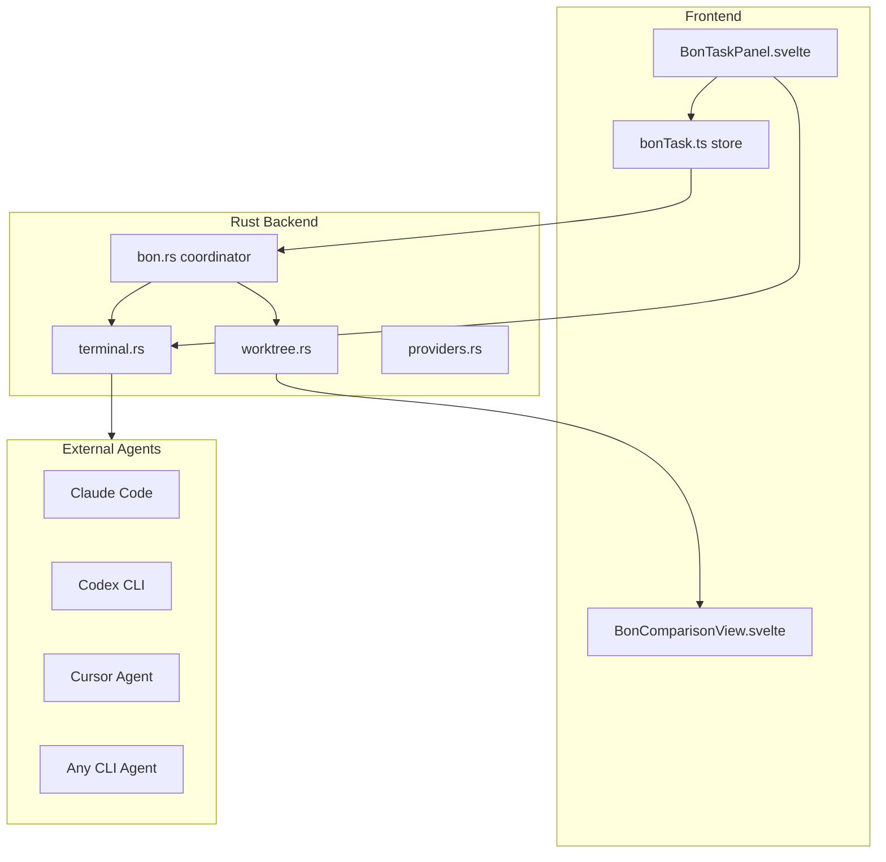
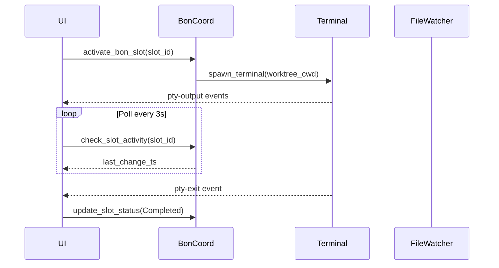

# Agent-Agnostic BoN (Bag-of-N) Support

## Architecture Overview




## Phase 1: Backend Coordinator

Create new module [src-tauri/src/commands/bon.rs](src-tauri/src/commands/bon.rs) with:

### Data Structures

```rust
pub struct BonTask {
    pub task_id: String,
    pub description: String,
    pub main_cwd: String,
    pub slots: Vec<BonSlot>,
    pub created_at: String,
    pub status: BonTaskStatus,
}

pub struct BonSlot {
    pub slot_id: String,
    pub worktree_session_id: Option<String>,  // tyck worktree ID
    pub provider_id: Option<String>,           // "claude-code", "codex", etc.
    pub terminal_id: Option<String>,           // PTY terminal ID
    pub status: SlotStatus,
    pub started_at: Option<String>,
    pub completed_at: Option<String>,
}

pub enum SlotStatus {
    Empty,                    // No worktree yet
    Ready,                    // Worktree created, waiting for agent
    Running,                  // Agent detected/running
    Completed,                // Agent finished
    Failed { error: String },
}

pub enum BonTaskStatus {
    Setup,                              // Creating slots
    Running { completed: usize },       // Agents running
    Comparing,                          // All done, user comparing
    Completed { winner: String },       // User selected winner
    Cancelled,
}
```

### Commands


| Command              | Purpose                               |
| -------------------- | ------------------------------------- |
| `create_bon_task`    | Create task with N empty slots        |
| `activate_bon_slot`  | Create worktree + terminal for a slot |
| `update_slot_status` | Mark slot as running/completed        |
| `get_bon_task`       | Get current task state                |
| `get_bon_comparison` | Generate cross-slot diff comparison   |
| `select_bon_winner`  | Accept winner's files, cleanup others |
| `cancel_bon_task`    | Cleanup all worktrees                 |


### Storage

- Store tasks in `~/.tyck/bon/<task_id>.json`
- Leverage existing worktree metadata in `~/.tyck/worktrees/`

---

## Phase 2: Completion Detection

Add completion detection to [src-tauri/src/commands/bon.rs](src-tauri/src/commands/bon.rs):

### Detection Strategies

1. **Terminal Exit**: Listen for `pty-exit-{id}` events (already emitted by [terminal.rs](src-tauri/src/commands/terminal.rs))
2. **File Activity Monitor**: Track last modification time in worktree
  ```rust
   pub fn check_slot_activity(slot_id: String) -> SlotActivity {
       // Return last_file_change timestamp
       // Frontend can poll and detect "no changes for N seconds"
   }
  ```
3. **Provider-Specific**: Reuse existing discovery logic from [providers.rs](src-tauri/src/commands/providers.rs)
  - Claude: Check session file for `result` event
  - Codex: Check rollout file for completion
4. **Manual**: User clicks "Mark Complete" button

### Auto-Detection Flow




---

## Phase 3: Comparison Engine

Add to [src-tauri/src/commands/bon.rs](src-tauri/src/commands/bon.rs):

### Comparison Data

```rust
pub struct BonComparison {
    pub task_id: String,
    pub slots: Vec<SlotSummary>,
    pub file_matrix: Vec<FileComparison>,
    pub consensus: ConsensusAnalysis,
}

pub struct SlotSummary {
    pub slot_id: String,
    pub provider_name: Option<String>,
    pub files_changed: usize,
    pub total_additions: i32,
    pub total_deletions: i32,
}

pub struct FileComparison {
    pub path: String,
    pub slots_that_modified: Vec<String>,  // slot_ids
    pub content_identical: bool,            // true if all made same change
}

pub struct ConsensusAnalysis {
    pub unanimous_files: Vec<String>,       // ALL slots modified
    pub partial_files: Vec<String>,         // SOME slots modified
    pub unique_files: Vec<(String, String)>,// (path, only_slot_id)
}
```

### Implementation

Reuse `scan_worktree_changes` from [worktree.rs](src-tauri/src/commands/worktree.rs) for each slot, then cross-compare:

```rust
pub fn get_bon_comparison(task_id: String) -> Result<BonComparison, String> {
    let task = load_bon_task(&task_id)?;
    let mut all_diffs: HashMap<String, Vec<(String, WorktreeFileDiff)>> = HashMap::new();
    
    for slot in &task.slots {
        if let Some(ref wt_session) = slot.worktree_session_id {
            let diffs = scan_worktree_changes(wt_session.clone())?;
            for diff in diffs {
                all_diffs.entry(diff.path.clone())
                    .or_default()
                    .push((slot.slot_id.clone(), diff));
            }
        }
    }
    
    // Build file_matrix and consensus from all_diffs
    // ...
}
```

---

## Phase 4: Frontend Store

Create [src/lib/stores/bonTask.ts](src/lib/stores/bonTask.ts):

```typescript
interface BonTask {
    taskId: string;
    description: string;
    mainCwd: string;
    slots: BonSlot[];
    status: BonTaskStatus;
}

interface BonSlot {
    slotId: string;
    worktreeSessionId: string | null;
    providerId: string | null;
    terminalId: string | null;
    status: 'empty' | 'ready' | 'running' | 'completed' | 'failed';
}

function createBonStore() {
    const task = writable<BonTask | null>(null);
    
    return {
        subscribe: task.subscribe,
        createTask: async (description: string, slotCount: number, mainCwd: string),
        activateSlot: async (slotId: string),
        markSlotComplete: async (slotId: string),
        getComparison: async () => BonComparison,
        selectWinner: async (slotId: string),
        cancel: async (),
    };
}
```

---

## Phase 5: UI Components

### BonTaskPanel.svelte

New component for [src/lib/components/BonTaskPanel.svelte](src/lib/components/BonTaskPanel.svelte):

- Task creation form (description + slot count)
- Slot cards showing status (empty/ready/running/completed)
- "Open Terminal" button per slot (calls `activateSlot`)
- Progress indicator (2/3 completed)
- "Compare Results" button (enabled when 2+ slots completed)

### BonComparisonView.svelte

New component for [src/lib/components/BonComparisonView.svelte](src/lib/components/BonComparisonView.svelte):

- Side-by-side slot summaries (files changed, +/- lines)
- File matrix showing which slots modified each file
- Consensus highlights (green = all agree, yellow = partial)
- "Select Winner" button per slot
- "Cherry-Pick" mode for mixing files from different slots

### Integration Points

- Add BoN button to [CommandRail.svelte](src/lib/components/CommandRail.svelte)
- Show BoN panel in [FocusZone.svelte](src/lib/components/FocusZone.svelte) when active
- Reuse [DiffOverlay.svelte](src/lib/components/DiffOverlay.svelte) for per-file comparison

---

## Phase 6: Winner Selection & Cleanup

### Select Winner Flow

```rust
pub fn select_bon_winner(task_id: String, winner_slot_id: String) -> Result<(), String> {
    let task = load_bon_task(&task_id)?;
    let winner = task.slots.iter().find(|s| s.slot_id == winner_slot_id)?;
    
    // 1. Accept all files from winner's worktree
    let diffs = scan_worktree_changes(winner.worktree_session_id.clone()?)?;
    for diff in diffs {
        accept_worktree_file(
            winner.worktree_session_id.clone()?,
            diff.path,
            diff.status,
            Some(true), // force
        )?;
    }
    
    // 2. Cleanup all worktrees (including winner)
    for slot in &task.slots {
        if let Some(ref wt_id) = slot.worktree_session_id {
            cleanup_worktree(wt_id.clone())?;
        }
    }
    
    // 3. Update task status
    update_bon_task_status(&task_id, BonTaskStatus::Completed { winner: winner_slot_id })?;
    
    Ok(())
}
```

### Cherry-Pick Flow (Advanced)

Allow selecting specific files from different slots:

```rust
pub fn cherry_pick_bon_files(
    task_id: String,
    selections: Vec<(String, String)>, // (file_path, slot_id)
) -> Result<(), String>
```

---

## Configuration

Add to settings ([src/lib/stores/settings.ts](src/lib/stores/settings.ts)):

```typescript
interface Settings {
    // ...existing
    bon: {
        defaultSlotCount: number;           // Default: 3
        completionInactivitySeconds: number; // Default: 30
        autoDetectCompletion: boolean;      // Default: true
    };
}
```

---

## File Changes Summary


| File                                          | Change                       |
| --------------------------------------------- | ---------------------------- |
| `src-tauri/src/commands/mod.rs`               | Add `pub mod bon;`           |
| `src-tauri/src/commands/bon.rs`               | New: coordinator module      |
| `src-tauri/src/lib.rs`                        | Register new bon commands    |
| `src/lib/stores/bonTask.ts`                   | New: frontend store          |
| `src/lib/components/BonTaskPanel.svelte`      | New: task/slot management UI |
| `src/lib/components/BonComparisonView.svelte` | New: results comparison UI   |
| `src/lib/components/CommandRail.svelte`       | Add BoN launch button        |
| `src/lib/stores/settings.ts`                  | Add bon config section       |


