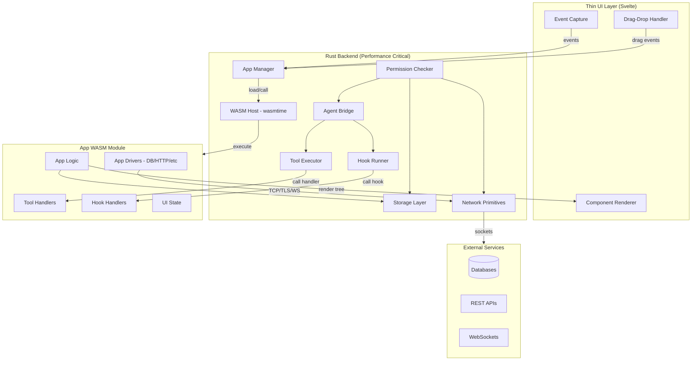
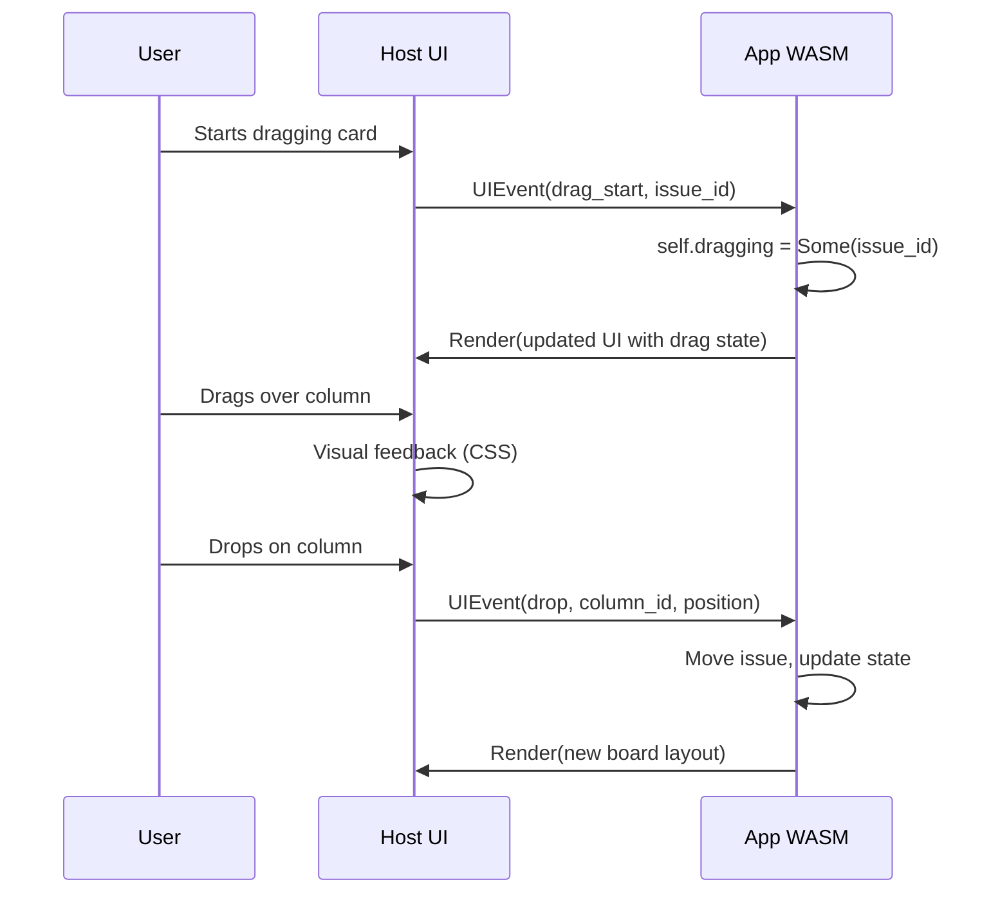

# Tapp Extension System Implementation Plan

## Core Principles

### 1. Performance First

**Everything heavy runs in the backend (Rust/WASM). The frontend is a thin rendering layer.**

### 2. Agent-Native Development

**Apps are primarily built by AI agents, not humans.** This changes everything:

- **Rust complexity is irrelevant** - Agents don't struggle with borrow checker
- **Boilerplate is free** - Agents generate it without fatigue
- **Type safety is a feature** - Compiler errors = faster iteration for agents
- **Documentation is for agents** - Structured examples, not tutorials


| Layer              | Responsibility                     | Technology            |
| ------------------ | ---------------------------------- | --------------------- |
| **UI Rendering**   | Display components, capture events | Svelte (thin)         |
| **Business Logic** | All app logic, data processing     | Rust WASM             |
| **Tool Handlers**  | Agent tool execution               | Rust WASM (mandatory) |
| **Agent Hooks**    | Input/output interception          | Rust WASM (mandatory) |
| **Storage**        | SQLite, JSON, session state        | Rust                  |
| **Permissions**    | Security enforcement               | Rust                  |


**What the frontend does NOT do:**

- No business logic
- No tool handler execution
- No hook callbacks
- No heavy computation
- No direct storage access

---

## Architecture Overview




## Phase 1: Foundation (WASM-First)

### 1.1 WASM Runtime Core

Build the wasmtime-based execution environment in Rust.

**New Rust Modules** (`src-tauri/src/wasm/`):

```rust
// src-tauri/src/wasm/mod.rs
pub mod host;       // Wasmtime engine, linker setup
pub mod sandbox;    // WASI capability restrictions  
pub mod limits;     // Memory/CPU resource limits
pub mod instance;   // Module instantiation, lifecycle
```

**Key Implementation**:

```rust
// Resource limits enforced at WASM level
struct WasmLimits {
    max_memory_bytes: usize,      // e.g., 256MB per app
    max_execution_ms: u64,        // e.g., 5000ms per call
    max_table_elements: u32,      // Function table size
}

// WASI capabilities - deny by default
struct WasiCapabilities {
    fs_preopens: Vec<PathBuf>,    // Only granted paths
    env_vars: HashMap<String, String>,
    // No ambient network, no ambient filesystem
}
```

**Dependencies** (`src-tauri/Cargo.toml`):

- `wasmtime = "19"` - WASM runtime
- `wasmtime-wasi = "19"` - WASI support
- `wit-bindgen = "0.24"` - Component model bindings

### 1.2 tapp Crate

Create the Rust SDK for app developers (`packages/tapp/`).

**Crate Structure**:

```
packages/tapp/
├── Cargo.toml
├── src/
│   ├── lib.rs          # Public API, re-exports
│   ├── app.rs          # App trait definition
│   ├── action.rs       # Action/Response types
│   ├── ui.rs           # UI component builders
│   ├── storage.rs      # Storage API
│   ├── agent.rs        # Agent interaction API
│   └── tools.rs        # Tool definition macros
├── macros/
│   └── src/lib.rs      # Proc macros (#[tapp::app], #[tool])
└── wit/
    └── tapp.wit        # Component model interface
```

**Core Trait**:

```rust
#[tapp::app]
pub trait App: Send + Sync {
    fn init(&mut self, ctx: &Context) -> Result<()>;
    fn shutdown(&mut self) -> Result<()>;
    fn handle(&mut self, action: Action) -> Result<Response>;
    fn render(&self) -> UITree;  // Returns declarative UI
}
```

**Tool Registration** (compile-time, not runtime):

```rust
#[tapp::tools]
impl MyApp {
    /// Query the database - called by agent
    #[tool(name = "query_db", description = "Execute SQL query")]
    fn query_db(&mut self, sql: String, limit: Option<u32>) -> ToolResult {
        // Runs in WASM, guaranteed performance
        let rows = self.db.query(&sql, limit.unwrap_or(100))?;
        ToolResult::json(json!({ "rows": rows }))
    }
}
```

**Hook Registration** (compile-time):

```rust
#[tapp::hooks]
impl MyApp {
    /// Intercept agent input - runs in WASM, must be fast
    #[hook(on_before_input)]
    fn enrich_input(&self, input: &str, session: &Session) -> Option<String> {
        if input.contains("database") {
            Some(format!("{}\n\nConnected DBs: {}", input, self.list_dbs()))
        } else {
            None  // Pass through unchanged
        }
    }
}
```

### 1.3 App Manager (Rust)

Central coordinator for app lifecycle.

**New Rust Modules** (`src-tauri/src/apps/`):

```rust
// src-tauri/src/apps/mod.rs
pub mod manager;      // App lifecycle orchestration
pub mod registry;     // Installed apps database
pub mod permissions;  // Permission checking
pub mod ipc;          // Frontend <-> WASM bridge
pub mod tools;        // Tool registry and routing
pub mod hooks;        // Hook registry and dispatch
```

**App Manager Responsibilities**:

- Load/unload WASM modules
- Route UI events to app's `handle()` method
- Dispatch tool calls to app's tool handlers
- Run hooks through app's hook handlers
- Enforce permissions before any operation

**IPC Protocol** (Frontend -> Backend -> WASM):

```rust
enum AppMessage {
    // UI events from thin frontend
    UIEvent { component_id: String, event: UIEventType },
    
    // Lifecycle
    Init,
    Shutdown,
    
    // These NEVER come from frontend - internal only
    ToolCall { name: String, args: Value },
    HookTrigger { hook: HookType, data: Value },
}

enum AppResponse {
    // UI update - sent to frontend for rendering
    Render(UITree),
    
    // Tool result - sent to agent
    ToolResult(ToolResult),
    
    // Hook result - continues agent flow
    HookResult(HookResult),
}
```

### 1.4 Thin UI SDK

Minimal TypeScript that only renders and captures events.

**What it does**:

- Receives `UITree` from backend
- Renders to DOM using Svelte components
- Captures DOM events, sends to backend
- Zero business logic

**Component Library**:


| Category     | Components                                                                        |
| ------------ | --------------------------------------------------------------------------------- |
| **Layout**   | `View`, `HStack`, `VStack`, `Panel`, `Split`, `Tabs`, `Scroll`, `Modal`, `Drawer` |
| **Content**  | `Text`, `Code`, `Markdown`, `Icon`, `Image`, `Badge`, `Avatar`                    |
| **Input**    | `Button`, `Input`, `TextArea`, `Select`, `Checkbox`, `Toggle`, `Slider`           |
| **Data**     | `List`, `VirtualList`, `Tree`, `Table`, `DataGrid`                                |
| **Feedback** | `Toast`, `Progress`, `Spinner`, `Empty`, `Skeleton`, `Alert`                      |


**Event System**:

All components support standard events sent to WASM:

```rust
ui::Button {
    label: "Submit",
    on_click: "submit_form",           // Action name
    on_click_data: json!({ "id": 1 }), // Optional payload
}

ui::Input {
    value: self.query.clone(),
    on_change: "update_query",
    on_submit: "execute_query",
}
```

**Drag-and-Drop Events**:

Critical for Kanban boards, file managers, and reorderable lists:

```rust
ui::View {
    class: "issue-card",
    draggable: true,
    on_drag_start: ("drag_start", json!({ "issue_id": issue.id })),
    on_drag_end: "drag_end",
}.children([...])

ui::View {
    class: "column",
    on_drag_over: "drag_over",  // Allows drop
    on_drop: ("drop", json!({ "column_id": column.id })),
}.children([...])
```

**Drag-and-Drop Flow**:




**Component Mapping** (Svelte):

```typescript
// packages/tapp-ui/src/renderer.ts
function render(tree: UITree): SvelteComponent {
    switch (tree.type) {
        case 'View': 
            return View({
                ...tree.props,
                draggable: tree.props.draggable,
                ondragstart: () => sendEvent(tree.id, 'drag_start', tree.props.on_drag_start_data),
                ondrop: (e) => sendEvent(tree.id, 'drop', { ...tree.props.on_drop_data, position: getDropPosition(e) }),
                children: tree.children.map(render)
            });
        case 'Button': 
            return Button({
                ...tree.props,
                onClick: () => sendEvent(tree.id, 'click', tree.props.on_click_data)
            });
        // ... other components
    }
}
```

**UITree Format** (from Rust):

```rust
pub struct UINode {
    pub id: String,
    pub node_type: NodeType,
    pub props: HashMap<String, Value>,
    pub children: Vec<UINode>,
}

pub enum NodeType {
    // Layout
    View, HStack, VStack, Panel, Split, Tabs, Scroll, Modal, Drawer,
    // Content
    Text, Code, Markdown, Icon, Image, Badge, Avatar,
    // Input
    Button, Input, TextArea, Select, Checkbox, Toggle, Slider,
    // Data
    List, VirtualList, Tree, Table, DataGrid,
    // Feedback
    Toast, Progress, Spinner, Empty, Skeleton, Alert,
}
```

### 1.5 CLI Tooling

Rust-based CLI for app development.

**Binary**: `tapp` (no conflicts found with existing CLIs)

**Name Verification**:

- `tapp` - Not taken on Homebrew, npm, crates.io, or as a major CLI tool
- `tyck` - Also available, but `tapp` is shorter and more memorable
- Avoided: `tap` (Node TAP testing), `tyk` (API gateway)

**Commands**:

- `tapp init <name>` - Scaffold Rust app
- `tapp dev [path]` - Build WASM + watch for changes
- `tapp build [path]` - Release build, create `.tapp`
- `tapp install <path>` - Install with permission review
- `tapp list` - Show installed apps
- `tapp uninstall <id>` - Remove app
- `tapp run <id>` - Launch app in Tyck

**Templates** (Rust-first):

- `minimal` - UI-only app, simple Rust
- `tool` - Agent tool, no UI
- `full` - UI + tools + hooks
- `sidebar` - Sidebar panel app

**Generated App Structure**:

```
my-app/
├── Cargo.toml
├── src/
│   └── lib.rs          # App implementation
├── manifest.json       # Metadata, permissions
└── assets/
    └── icon.svg
```

---

## Phase 2: Agent Integration (All Backend)

### 2.1 Tapp Tools (WASM-Only Execution)

**Critical**: Tool handlers execute in WASM, never in JS.

**Tool Registry** (`src-tauri/src/apps/tools.rs`):

```rust
pub struct ToolRegistry {
    tools: HashMap<String, RegisteredTool>,
}

struct RegisteredTool {
    app_id: String,
    definition: ToolDefinition,
    // Handler is NOT a callback - it's the WASM function name
    wasm_handler: String,
}

impl ToolRegistry {
    /// Called when agent invokes a tool
    pub async fn execute(&self, name: &str, args: Value) -> Result<ToolResult> {
        let tool = self.tools.get(name)?;
        
        // Permission check
        self.check_permission(&tool.app_id, "agent:tools")?;
        
        // Execute in WASM - guaranteed performance
        let app_manager = get_app_manager();
        let result = app_manager
            .call_wasm_function(&tool.app_id, &tool.wasm_handler, args)
            .await?;
        
        Ok(result)
    }
}
```

**Tool Discovery** (at app load time):

```rust
// When loading app WASM, extract tool definitions from metadata
fn discover_tools(module: &Module) -> Vec<ToolDefinition> {
    // Tools are declared via #[tool] macro, embedded in WASM custom section
    module.custom_section("tapp:tools")
        .map(|data| deserialize_tools(data))
        .unwrap_or_default()
}
```

### 2.2 Agent Hooks (Rust-Only Execution)

**Critical**: Hooks execute in WASM, never in JS. Must complete fast.

**Hook Types**:

```rust
pub enum HookType {
    BeforeInput,    // Can modify input, must complete in <100ms
    AfterOutput,    // Observe only, must complete in <50ms
    OnToolCall,     // Observe tool invocations
    SessionStart,   // Session lifecycle
    SessionEnd,
}

pub struct HookResult {
    pub modified_input: Option<String>,  // For BeforeInput
    pub should_continue: bool,           // Can cancel
}
```

**Hook Dispatcher** (`src-tauri/src/apps/hooks.rs`):

```rust
pub struct HookDispatcher {
    hooks: HashMap<HookType, Vec<RegisteredHook>>,
}

impl HookDispatcher {
    /// Run all registered hooks for an event
    pub async fn dispatch(&self, hook_type: HookType, data: Value) -> Result<HookResult> {
        let hooks = self.hooks.get(&hook_type).unwrap_or(&vec![]);
        
        let mut result = HookResult::default();
        
        for hook in hooks {
            // Timeout enforcement - hooks MUST be fast
            let timeout = match hook_type {
                HookType::BeforeInput => Duration::from_millis(100),
                _ => Duration::from_millis(50),
            };
            
            let app_manager = get_app_manager();
            let hook_result = tokio::time::timeout(
                timeout,
                app_manager.call_wasm_function(&hook.app_id, &hook.wasm_handler, data.clone())
            ).await;
            
            match hook_result {
                Ok(Ok(r)) => result.merge(r),
                Ok(Err(e)) => log::warn!("Hook {} failed: {}", hook.name, e),
                Err(_) => log::warn!("Hook {} timed out", hook.name),
            }
            
            if !result.should_continue {
                break;
            }
        }
        
        Ok(result)
    }
}
```

### 2.3 Agent Session Spawning

Apps can spawn and manage agent sessions from WASM.

**API exposed to WASM**:

```rust
// Host functions available to WASM modules
#[wasm_import]
mod tyck {
    fn agent_spawn(options: SpawnOptions) -> Result<SessionId>;
    fn agent_send(session_id: SessionId, text: &str) -> Result<()>;
    fn agent_get_output(session_id: SessionId) -> Result<Option<String>>;
    fn agent_kill(session_id: SessionId) -> Result<()>;
    fn agent_inject(text: &str) -> Result<()>;  // To active session
}
```

**Backend Implementation** (`src-tauri/src/apps/agent_bridge.rs`):

```rust
pub struct AgentBridge {
    sessions: HashMap<String, AppAgentSession>,
}

impl AgentBridge {
    pub fn spawn_for_app(
        &mut self,
        app_id: &str,
        options: SpawnOptions
    ) -> Result<SessionId> {
        // Permission check
        check_permission(app_id, "agent:spawn")?;
        
        // Spawn via existing terminal/agent infrastructure
        let session_id = spawn_agent_terminal(
            options.provider,
            options.cwd,
            options.system_prompt,
        )?;
        
        self.sessions.insert(session_id.clone(), AppAgentSession {
            app_id: app_id.to_string(),
            visible: options.visible,
        });
        
        Ok(session_id)
    }
}
```

### 2.4 Storage Layer (All Rust)

Storage operations run in Rust, exposed to WASM via host functions.

**Host Functions**:

```rust
#[wasm_import]
mod tyck {
    // JSON store
    fn storage_json_get(key: &str) -> Result<Option<Value>>;
    fn storage_json_set(key: &str, value: Value) -> Result<()>;
    fn storage_json_delete(key: &str) -> Result<()>;
    
    // SQLite
    fn storage_sql_execute(sql: &str, params: &[Value]) -> Result<u64>;
    fn storage_sql_query(sql: &str, params: &[Value]) -> Result<Vec<Row>>;
    
    // Session (in-memory)
    fn storage_session_get(key: &str) -> Result<Option<Value>>;
    fn storage_session_set(key: &str, value: Value) -> Result<()>;
}
```

**Implementation** (`src-tauri/src/apps/storage.rs`):

```rust
pub struct AppStorage {
    app_id: String,
    json_path: PathBuf,      // ~/.tyck/apps/{id}/data/store.json
    db_path: PathBuf,        // ~/.tyck/apps/{id}/data/app.db
    session: HashMap<String, Value>,  // In-memory
}

impl AppStorage {
    pub fn new(app_id: &str) -> Result<Self> {
        let base = dirs::home_dir()?.join(".tyck/apps").join(app_id).join("data");
        fs::create_dir_all(&base)?;
        
        Ok(Self {
            app_id: app_id.to_string(),
            json_path: base.join("store.json"),
            db_path: base.join("app.db"),
            session: HashMap::new(),
        })
    }
    
    pub fn sql_execute(&self, sql: &str, params: &[Value]) -> Result<u64> {
        let conn = rusqlite::Connection::open(&self.db_path)?;
        Ok(conn.execute(sql, rusqlite::params_from_iter(params))? as u64)
    }
}
```

### 2.5 Network Primitives

Apps bring their own drivers/protocols. The host provides low-level network primitives.

**Design Principle**: Host provides sockets, not database drivers. Apps bundle their own protocol implementations (Postgres, MySQL, Redis, HTTP clients, etc.) compiled into WASM.

**Host Functions** (`src-tauri/src/apps/network.rs`):

```rust
#[wasm_import]
mod tyck {
    // TCP sockets
    fn net_tcp_connect(host: &str, port: u16) -> Result<SocketId>;
    fn net_tcp_read(socket: SocketId, len: usize) -> Result<Vec<u8>>;
    fn net_tcp_write(socket: SocketId, data: &[u8]) -> Result<usize>;
    fn net_tcp_close(socket: SocketId) -> Result<()>;
    
    // TLS (required for most production services)
    fn net_tls_connect(host: &str, port: u16) -> Result<SocketId>;
    fn net_tls_read(socket: SocketId, len: usize) -> Result<Vec<u8>>;
    fn net_tls_write(socket: SocketId, data: &[u8]) -> Result<usize>;
    
    // WebSocket (for real-time apps)
    fn net_ws_connect(url: &str) -> Result<WebSocketId>;
    fn net_ws_send(ws: WebSocketId, data: &[u8]) -> Result<()>;
    fn net_ws_recv(ws: WebSocketId) -> Result<Option<Vec<u8>>>;
    fn net_ws_close(ws: WebSocketId) -> Result<()>;
    
    // HTTP convenience layer (built on TCP/TLS)
    fn net_http_request(
        method: &str,
        url: &str,
        headers: &[(String, String)],
        body: Option<&[u8]>
    ) -> Result<HttpResponse>;
    
    // DNS resolution
    fn net_resolve(hostname: &str) -> Result<Vec<IpAddr>>;
}

struct HttpResponse {
    status: u16,
    headers: Vec<(String, String)>,
    body: Vec<u8>,
}
```

**Permission Model**:

```json
{
  "permissions": ["network:unrestricted"]
}
```

Or restricted to specific hosts:

```json
{
  "permissions": ["network:fetch"],
  "network": {
    "allowedHosts": [
      "api.example.com:443",
      "*.database.example.com:5432"
    ]
  }
}
```

**Why This Approach**:


| Host-provided drivers    | App-provided drivers (chosen)    |
| ------------------------ | -------------------------------- |
| Limited to what we build | Any driver, any protocol         |
| Version locked to Tyck   | App controls versions            |
| Smaller WASM             | Larger WASM (1-5MB per driver)   |
| Can't support niche DBs  | Redis, MongoDB, ClickHouse, etc. |


**Example: App with Postgres**:

```rust
// App's Cargo.toml
[dependencies]
tapp = "0.1"
tokio-postgres = "0.7"  # Compiles to WASM

// App code
use tokio_postgres::{NoTls, Client};

impl SqlExplorer {
    async fn connect(&mut self, conn_str: &str) -> Result<()> {
        // Driver uses tapp's net_tcp_connect under the hood
        let (client, connection) = tokio_postgres::connect(conn_str, NoTls).await?;
        self.client = Some(client);
        Ok(())
    }
}
```

---

## Phase 3: Polish and Performance Optimization

### 3.1 Advanced UI Components (Host-Rendered)

Components render on the host side for performance. App sends data, host handles rendering.

**VirtualList** - Host manages viewport, only renders visible items:

```rust
// In app WASM
fn render(&self) -> UITree {
    ui::VirtualList {
        items: self.items.len(),  // Just count
        item_height: 32,
        render_item: |index| {
            // Called by host for visible items only
            let item = &self.items[index];
            ui::Text { content: item.name.clone() }
        }
    }
}
```

**DataGrid** - Sorting/filtering in WASM, rendering in host:

```rust
fn render(&self) -> UITree {
    ui::DataGrid {
        columns: vec!["Name", "Size", "Modified"],
        rows: self.get_visible_rows(),  // Pre-filtered in WASM
        on_sort: |col| self.sort_by(col),
        on_filter: |query| self.filter(query),
    }
}
```

**Tree** - Expand/collapse state in WASM:

```rust
fn render(&self) -> UITree {
    ui::Tree {
        nodes: self.build_visible_tree(),  // Only expanded nodes
        on_toggle: |node_id| self.toggle_expand(node_id),
    }
}
```

### 3.2 Layout Modes

Manifest-declared, host-managed layouts.

```json
{
  "ui": {
    "layout": "full" | "sidebar" | "panel" | "modal"
  }
}
```

**Host Implementation** (Svelte):

- `full`: Replace ContextZone + FocusZone
- `sidebar`: Replace ContextZone only
- `panel`: Add below TerminalPanel
- `modal`: Overlay with backdrop

### 3.3 Hot Reload (WASM Module Replacement)

Replace WASM module without restarting app or losing state.

**Process**:

1. File watcher detects `.wasm` change
2. Serialize current app state via `App::serialize_state()`
3. Unload old module, load new module
4. Restore state via `App::deserialize_state(state)`
5. Re-render UI

```rust
pub trait App {
    // ... existing methods ...
    
    fn serialize_state(&self) -> Result<Vec<u8>> {
        Ok(vec![])  // Default: no state
    }
    
    fn deserialize_state(&mut self, _state: Vec<u8>) -> Result<()> {
        Ok(())  // Default: ignore
    }
}
```

### 3.4 App Store

**Package Signing**:

```rust
struct SignedPackage {
    manifest: Manifest,
    wasm_hash: [u8; 32],
    signature: Ed25519Signature,
    public_key: Ed25519PublicKey,
}
```

**Registry API**:

- `GET /apps` - List apps with metadata
- `GET /apps/{id}` - App details
- `GET /apps/{id}/download` - Download `.tapp`
- `POST /apps` - Publish (authenticated)

**Auto-Update**:

- Check for updates on app launch
- Download in background
- Apply on next restart

---

## Performance Guarantees


| Operation              | Max Latency | Enforcement         |
| ---------------------- | ----------- | ------------------- |
| Tool handler execution | 5000ms      | wasmtime fuel/epoch |
| Hook (BeforeInput)     | 100ms       | tokio::timeout      |
| Hook (AfterOutput)     | 50ms        | tokio::timeout      |
| UI render cycle        | 16ms        | Host-side, not WASM |
| Storage read           | N/A         | Async, non-blocking |
| Storage write          | N/A         | Async, buffered     |


**Resource Limits per App**:

```rust
const WASM_LIMITS: WasmLimits = WasmLimits {
    max_memory_bytes: 256 * 1024 * 1024,  // 256MB
    max_execution_fuel: 100_000_000,       // ~5s of compute
    max_table_elements: 10_000,
};
```

---

## Storage Layout

```
~/.tyck/
├── apps/
│   ├── registry.json              # Installed apps list
│   └── {app-id}/
│       ├── manifest.json
│       ├── app.wasm               # Compiled WASM module
│       ├── assets/
│       │   └── icon.svg
│       └── data/
│           ├── store.json         # JSON key-value
│           └── app.db             # SQLite database
├── settings.json
└── themes/
```

**Note**: No `app.js` or `app.css` - apps are WASM only. UI is rendered by host.

---

## Security Model

**WASM Sandboxing** (Primary):

- No ambient filesystem access (explicit preopens only)
- No ambient network access (explicit capability grants)
- Memory isolation via linear memory
- CPU limits via fuel metering

**Permission System** (from manifest):

- `fs:read/write/system` - Filesystem access levels
- `network:fetch/unrestricted` - Network restrictions
- `storage:session/persistent` - Storage tiers
- `agent:inject/tools/hooks/spawn` - Agent integration levels

**Runtime Enforcement**:

```rust
fn check_permission(app_id: &str, permission: &str) -> Result<()> {
    let manifest = load_manifest(app_id)?;
    if !manifest.permissions.contains(permission) {
        return Err(TappError::PermissionDenied(permission.to_string()));
    }
    Ok(())
}
```

---

## Key Integration Points

**Modify Existing Files**:

- `src-tauri/src/lib.rs` - Add app commands to invoke_handler
- `src-tauri/Cargo.toml` - Add wasmtime, rusqlite dependencies

**New Rust Modules**:

```
src-tauri/src/
├── wasm/
│   ├── mod.rs
│   ├── host.rs         # Wasmtime engine
│   ├── sandbox.rs      # WASI capabilities
│   ├── limits.rs       # Resource limits
│   └── instance.rs     # Module lifecycle
├── apps/
│   ├── mod.rs
│   ├── manager.rs      # App lifecycle
│   ├── registry.rs     # Installation registry
│   ├── permissions.rs  # Permission checks
│   ├── ipc.rs          # Frontend bridge
│   ├── tools.rs        # Tool registry
│   ├── hooks.rs        # Hook dispatcher
│   ├── storage.rs      # Storage layer
│   ├── network.rs      # TCP/TLS/WebSocket/HTTP primitives
│   └── agent_bridge.rs # Agent API
```

**New Packages**:

- `packages/tapp/` - Rust crate for app development (published to crates.io)
- `packages/tapp-ui/` - Thin UI renderer (Svelte)
- `packages/tapp-cli/` - CLI binary (`tapp` command)

---

## Development Workflow (Rust-First)

```bash
# 1. Create new app
tapp init my-database-explorer
cd my-database-explorer

# 2. Edit Rust code
$EDITOR src/lib.rs

# 3. Development mode (builds WASM, watches for changes)
tapp dev

# 4. Build release package
tapp build

# 5. Install
tapp install ./target/my-database-explorer.tapp

# 6. Open in Tyck
# Press Cmd+Shift+A -> Select "My Database Explorer"
```

**Example App** (`src/lib.rs`):

```rust
use tapp::prelude::*;

#[tapp::app]
pub struct DatabaseExplorer {
    connections: Vec<Connection>,
    query_results: Option<Vec<Row>>,
}

impl App for DatabaseExplorer {
    fn init(&mut self, _ctx: &Context) -> Result<()> {
        Ok(())
    }
    
    fn handle(&mut self, action: Action) -> Result<Response> {
        match action.name() {
            "connect" => {
                let conn_str: String = action.get("connection_string")?;
                self.connections.push(Connection::open(&conn_str)?);
                Ok(Response::ok())
            }
            "query" => {
                let sql: String = action.get("sql")?;
                self.query_results = Some(self.connections[0].query(&sql)?);
                Ok(Response::render())  // Trigger re-render
            }
            _ => Ok(Response::not_found())
        }
    }
    
    fn render(&self) -> UITree {
        ui::Panel { title: "Database Explorer" }.children([
            ui::Button { label: "Connect", on_click: "connect" },
            ui::Input { placeholder: "SELECT * FROM ...", on_submit: "query" },
            if let Some(rows) = &self.query_results {
                ui::DataGrid { rows: rows.clone() }
            } else {
                ui::Empty { message: "No results" }
            }
        ])
    }
}

#[tapp::tools]
impl DatabaseExplorer {
    #[tool(description = "Execute SQL query")]
    fn query_database(&mut self, sql: String) -> ToolResult {
        let rows = self.connections[0].query(&sql)?;
        ToolResult::json(json!({ "rows": rows }))
    }
}
```

---

## Agent-Oriented Developer Experience

Since AI agents are the primary app developers, optimize for agent consumption:

### Agent System Prompt Template

Provide a system prompt that agents can use when building Tapp apps:

```markdown
You are building a Tapp extension for Tyck IDE.

## Tapp Architecture
- Apps are Rust compiled to WASM
- UI is declarative (render() returns UITree)
- Business logic runs in handle() method
- Tools are exposed to AI agents via #[tool] macro
- Hooks intercept agent I/O via #[hook] macro

## Key Patterns

### App Structure
- Implement `tapp::App` trait
- State lives in struct fields
- UI events trigger handle() with Action
- Return Response::render() to update UI

### Tool Definition
- Use #[tapp::tools] on impl block
- Each #[tool] method becomes agent-callable
- Return ToolResult::json() for structured data

### Common Errors
- E0382 (use after move): Clone the value or use references
- E0502 (borrow conflict): Restructure to avoid simultaneous borrows
- E0277 (trait not implemented): Add #[derive(Clone, Serialize)] as needed
```

### Structured Examples Library

Create `~/.tyck/tapp-examples/` with categorized examples:

```
tapp-examples/
├── patterns/
│   ├── basic-ui.rs           # Minimal app with button/text
│   ├── form-handling.rs      # Input, validation, submission
│   ├── list-crud.rs          # List with add/edit/delete
│   ├── async-data.rs         # Loading states, error handling
│   └── tool-registration.rs  # Agent tool with parameters
├── integrations/
│   ├── sqlite-crud.rs        # Database operations
│   ├── http-client.rs        # API calls
│   ├── file-watcher.rs       # FS monitoring
│   └── agent-spawn.rs        # Multi-agent patterns
└── complete-apps/
    ├── todo-app/             # Full working example
    ├── api-explorer/         # HTTP client app
    └── db-browser/           # Database browser
```

### Error Recovery Patterns

Document common compiler errors with fixes (agents can pattern-match):

```rust
// ERROR: E0382 - use of moved value
// BAD:
let data = fetch_data();
process(data);
save(data);  // Error: data was moved

// GOOD:
let data = fetch_data();
process(&data);  // Borrow instead
save(data);      // Move at end

// OR:
let data = fetch_data();
process(data.clone());
save(data);
```

### Manifest Schema (JSON Schema)

Provide strict JSON schema for `manifest.json` so agents can validate:

```json
{
  "$schema": "https://tyck.dev/schemas/tapp-manifest.json",
  "type": "object",
  "required": ["id", "name", "version", "permissions"],
  "properties": {
    "id": { "type": "string", "pattern": "^[a-z0-9-]+$" },
    "name": { "type": "string", "maxLength": 50 },
    "version": { "type": "string", "pattern": "^\\d+\\.\\d+\\.\\d+$" },
    "permissions": {
      "type": "array",
      "items": {
        "enum": [
          "fs:read", "fs:write", "fs:system",
          "network:fetch", "network:unrestricted",
          "storage:session", "storage:persistent",
          "agent:inject", "agent:tools", "agent:hooks", "agent:spawn"
        ]
      }
    }
  }
}
```

### Build Output for Agents

`tapp build` outputs structured JSON for agent consumption:

```json
{
  "success": true,
  "app_id": "my-app",
  "wasm_path": "./target/wasm32-wasip2/release/my_app.wasm",
  "wasm_size_bytes": 245760,
  "tools_registered": ["query_database", "list_tables"],
  "hooks_registered": ["on_before_input"],
  "permissions_required": ["storage:persistent", "agent:tools"],
  "build_time_ms": 3200
}
```

On failure:

```json
{
  "success": false,
  "errors": [
    {
      "code": "E0382",
      "message": "use of moved value: `data`",
      "file": "src/lib.rs",
      "line": 45,
      "suggestion": "Consider cloning: `data.clone()`"
    }
  ]
}
```

### Agent-Friendly CLI

All `tapp` commands support `--json` for structured output:

```bash
tapp build --json        # JSON build result
tapp list --json         # JSON list of installed apps
tapp install --json      # JSON install result with permission details
```

### Why This Matters


| Human Developer        | AI Agent Developer         |
| ---------------------- | -------------------------- |
| Reads tutorials        | Reads examples + schema    |
| Learns incrementally   | Generates complete code    |
| Debugs interactively   | Parses error JSON, retries |
| Needs IDE support      | Needs structured output    |
| Frustrated by compiler | Treats errors as feedback  |


